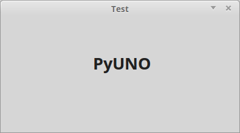
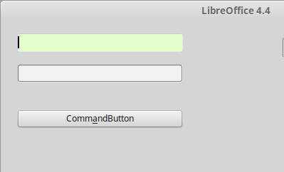

Dialogs
=======

Create dialog
-------------

Create dialog from path.

.. code-block:: vbnet

    Sub CreateDialog
        util = createUnoService("org.universolibre.EasyDev")

        path = "/home/USER/dlg_test.xdl"
        dlg = util.createDialog(path)
        dlg.execute()
        dlg.dispose()
    End Sub

Create dialog from Library, default library is **Standard**

.. code-block:: vbnet

    macro = createUnoStruct("org.universolibre.EasyDev.Macro")
    macro.Dialog = "Dialog1"

    dlg = util.createDialog(macro)

    'Use other library
    macro.Library = "MyLibrary"
    macro.Dialog = "MyDialog"

    dlg = util.createDialog(macro)

.. NOTE::
    If dialog is into document, use standard method createUnoDialog

Label hyperlink
---------------

Automatic add event mouse over

.. image:: images/img011.png
    :width: 350px
    :align: center

.. code-block:: vbnet

    path = "/home/USER/dlg_test.xdl"
    dlg = util.createDialog(path)

    properties = Array( _
        Array("Name", "link_home"), _
        Array("PositionX", 100), _
        Array("PositionY", 10), _
        Array("URL", "http://universolibre.org"), _
        Array("Label", "http://universolibre.org"), _
    )
    util.createControl(dlg, "FixedHyperlink", properties)
    dlg.execute()
    dlg.dispose()

Roadmap
-------

Add menu options, automatic add event item change for update property Step in dialog.

.. code-block:: vbnet

    path = "/home/USER/dlg_test.xdl"
    dlg = util.createDialog(path)

    options = Array("Init", "Values", "Config", "Other")
    properties = Array( _
        Array("Name", "roadmap"), _
        Array("Width", 50), _
        Array("Height", 150), _
        Array("Options", options), _
    )
    util.createControl(dlg, "Roadmap", properties)
    dlg.execute()
    dlg.dispose()

Grid
----

Create grid and set data from array. Detect column values and format.

.. image:: images/img013.png
    :width: 300px
    :align: center

.. code-block:: vbnet

    c1 = Array( _
        Array("Title", "State"), _
        Array("HorizontalAlign", 0), _
    )
    c2 = Array( _
        Array("Title", "People"), _
        Array("HorizontalAlign", 2), _
        Array("Identifier", True), _
    )
    columns = Array(c1, c2)
    properties = Array( _
        Array("Name", "grid"), _
        Array("PositionX", 100), _
        Array("PositionY", 50), _
        Array("Step", 4), _
        Array("Columns", columns), _
    )
    grid = util.createControl(dlg, "Grid", properties)

    data = Array( _
        Array("Uno", 2222), _
        Array("Tres", 44444), _
        Array("Cinco", 666666), _
        Array("Siete", 666666), _
    )
    col_format = Array()
    util.setGridData(grid, data, col_format)

    dlg.execute()
    dlg.dispose()

Add data from range cells.

.. code-block:: vbnet

    data = ThisComponent.getCurrentSelection().getDataarray()
    col_format = Array()
    util.setGridData(grid, data, col_format)

Change default format for columns with values.

.. code-block:: vbnet

    data = ThisComponent.getCurrentSelection().getDataarray()

    'Default format
    util.numfmt = "$ {0:,.2f}"

    col_format = Array()
    util.setGridData(grid, data, col_format)

Or change format for each column.

.. code-block:: vbnet

    data = ThisComponent.getCurrentSelection().getDataarray()
    col_format = Array("{}", "$ {0:,.2f}")
    util.setGridData(grid, data, col_format)

And get data grid in array.

.. code-block:: vbnet

    data = util.getGridData(grid, Array())
    util.msgbox(data)

TextBox
-------

Create text box, automatic change background color in focus events.

.. image:: images/img014.png
    :width: 300px
    :align: center

.. code-block:: vbnet

    properties = Array( _
        Array("Name", "txt_name"), _
        Array("PositionX", 10), _
        Array("PositionY", 10), _
    )
    util.createControl(dlg, "Edit", properties)
    dlg.execute()
    dlg.dispose()

You can change default background color. Change color before create control.

.. code-block:: vbnet

    util.colorOnFocus = RGB(229, 255, 204)

CommandButton
-------------

Create command button and assigned macro to execute. Default library is **Standard**.
For default, the macro name execute is: **CONTROL_NAME + _action**, in this example:

.. code-block:: vbnet

    Sub cmd_test_action(event):
        MsgBox event.Source.Model.Name
    End Sub

Argument **event** is important.

.. code-block:: vbnet

    macro.Language = "Basic"
    macro.Module = "LODialog"
    properties = Array( _
        Array("Name", "cmd_test"), _
        Array("PositionX", 10), _
        Array("PositionY", 60), _
        Array("Macro", macro), _
    )
    util.createControl(dlg, "Button", properties)
