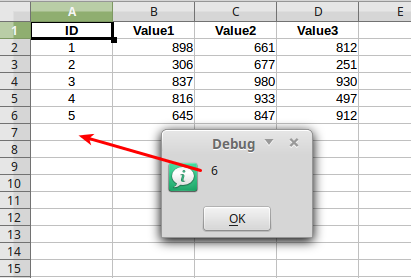

Calc
===============

Cells
-----

Get active cell, always back only one cell

.. code-block:: vbnet

    Sub getCellDoc()
        util = createUnoService("org.universolibre.EasyDev")
        address = createUnoStruct("org.universolibre.EasyDev.CellRangeAddress")

        address.Current = True
        cell = util.getCell(address)
        msg = util.format("{} {}", Array(cell.ImplementationName, cell.AbsoluteName))
        util.msgbox(msg)
    End Sub

Get active cell from document by title name, document must be open

.. code-block:: vbnet

        address.Doc = "test.ods"    'Title doc
        address.Current = True
        cell = util.getCell(address)
        msg = util.format("{} {}", Array(cell.ImplementationName, cell.AbsoluteName))
        util.msgbox(msg)

Get active cell from object doc

.. code-block:: vbnet

        doc = util.getDoc("")
        address.Doc = doc
        address.Current = True
        cell = util.getCell(address)
        msg = util.format("{} {}", Array(cell.ImplementationName, cell.AbsoluteName))
        util.msgbox(msg)

Get cell from object doc, sheet by name, cell by name

.. code-block:: vbnet

    doc = util.getDoc("")
    address.Doc = doc
    address.Sheet = "Sheet2"
    address.Name = "B5"
    cell = util.getCell(address)
    msg = util.format("{} {}", Array(cell.ImplementationName, cell.AbsoluteName))
    util.msgbox(msg)

Get cell from object doc, sheet by name, cell by col, row

.. code-block:: vbnet

    doc = util.getDoc("")
    address.Doc = doc
    address.Sheet = "Sheet2"
    address.Name = ""
    address.Col = 1
    address.Row = 4
    cell = util.getCell(address)
    msg = util.format("{} {}", Array(cell.ImplementationName, cell.AbsoluteName))
    util.msgbox(msg)

Get cell from object sheet, object doc is ommited

.. code-block:: vbnet

    sheet = doc.getCurrentController().getActiveSheet()
    address.Sheet = sheet
    address.Name = "D5"
    cell = util.getCell(address)
    msg = util.format("{} {}", Array(cell.ImplementationName, cell.AbsoluteName))
    util.msgbox(msg)

Ranges
------

Get active range

.. code-block:: vbnet

    Sub getRangeDoc()
        util = createUnoService("org.universolibre.EasyDev")
        address = createUnoStruct("org.universolibre.EasyDev.CellRangeAddress")

        address.Current = True
        range = util.getRange(address)
        msg = util.format("{} {}", Array(range.ImplementationName, range.AbsoluteName))
        util.msgbox(msg)
    End Sub

Get active range from document by title name, document must be open

.. code-block:: vbnet

    address.Doc = "test.ods"    'Title doc
    address.Current = True
    range = util.getRange(address)
    msg = util.format("{} {}", Array(range.ImplementationName, range.AbsoluteName))
    util.msgbox(msg)

Get active range from object doc

.. code-block:: vbnet

        doc = util.getDoc("")
        address.Doc = doc
        address.Current = True
        range = util.getRange(address)
        msg = util.format("{} {}", Array(range.ImplementationName, range.AbsoluteName))
        util.msgbox(msg)

Get range from object doc, sheet by name, range by name

.. code-block:: vbnet

    doc = util.getDoc("")
    address.Doc = doc
    address.Sheet = "Sheet2"
    address.Name = "B5:C10"
    range = util.getRange(address)
    msg = util.format("{} {}", Array(range.ImplementationName, range.AbsoluteName))
    util.msgbox(msg)

Get range from object doc, sheet by name, range by position

.. code-block:: vbnet

    address.Sheet = "Sheet2"
    address.Name = ""
    address.Col = 1
    address.Row = 4
    address.EndCol = 3
    address.EndRow = 9
    range = util.getRange(address)
    msg = util.format("{} {}", Array(range.ImplementationName, range.AbsoluteName))
    util.msgbox(msg)

Get range from object sheet, object doc is ommited

.. code-block:: vbnet

    sheet = doc.getCurrentController().getActiveSheet()
    address.Sheet = sheet
    address.Name = "D5:E10"
    range = util.getRange(address)
    msg = util.format("{} {}", Array(range.ImplementationName, range.AbsoluteName))
    util.msgbox(msg)

Select range
------------

.. code-block:: vbnet

    Sub SelectRange()
        util = createUnoService("org.universolibre.EasyDev")
        address = createUnoStruct("org.universolibre.EasyDev.CellRangeAddress")

        doc = util.getDoc("")
        address.Doc = doc
        address.Sheet = "Sheet2"
        address.Name = "B5:C10"
        range = util.getRange(address)

        'Select
        util.selectRange(doc, range)

    End Sub

Current region
--------------

.. code-block:: vbnet

    Sub getCurrentRegion()

        util = createUnoService("org.universolibre.EasyDev")
        address = createUnoStruct("org.universolibre.EasyDev.CellRangeAddress")

        address.Current = True
        cell = util.getCell(address)
        msg = util.format("{} {}", Array(cell.ImplementationName, cell.AbsoluteName))
        util.msgbox(msg)

    End Sub

Only one cell into current region is necesary, get cursor

.. code-block:: vbnet

    cursor = util.getCurrentRegion(cell, True)
    msg = util.format("{} {}", Array(cursor.ImplementationName, cursor.AbsoluteName))
    util.msgbox(msg)

Only one cell into current region is necesary, get range

.. code-block:: vbnet

    range = util.getCurrentRegion(cell, False)
    msg = util.format("{} {}", Array(range.ImplementationName, range.AbsoluteName))
    util.msgbox(msg)

Last row
--------

Get last row into current region.

.. code-block:: vbnet

    Sub getLastRow()
        util = createUnoService("org.universolibre.EasyDev")
        address = createUnoStruct("org.universolibre.EasyDev.CellRangeAddress")

        address.Current = True
        cell = util.getCell(address)
        row = util.getLastRow(cell)
        util.msgbox(row)
    End Sub

Next value
----------

In range values. Get nex value in column A(0), or B(1), etc.

.. code-block:: vbnet

    Sub getNextID()
        util = createUnoService("org.universolibre.EasyDev")
        address = createUnoStruct("org.universolibre.EasyDev.CellRangeAddress")

        address.Current = True
        cell = util.getCell(address)
        value = util.getNextID(cell, 0)
        util.msgbox(value)
    End Sub

Cell value
----------

Automatically detect type: string, value or formula.

.. code-block:: vbnet

    Sub CellValue()
        util = createUnoService("org.universolibre.EasyDev")
        address = createUnoStruct("org.universolibre.EasyDev.CellRangeAddress")

        address.Current = True
        cell = util.getCell(address)

        value = "String"
        util.setValue(cell, value)
        value = util.getValue(cell)
        util.msgbox(value)

        value = 12345
        util.setValue(cell, value)
        value = util.getValue(cell)
        util.msgbox(value)

        value = "=SUM(A1:C1)"
        util.setValue(cell, value)
        value = util.getValue(cell)
        util.msgbox(value)

    End Sub

.. _setdata:

Set data
--------

Automatically calculate width and height of data size.

.. code-block:: vbnet

    Sub SetData()
        util = createUnoService("org.universolibre.EasyDev")
        address = createUnoStruct("org.universolibre.EasyDev.CellRangeAddress")

        'Get active cell, always get one cell
        address.Current = True
        cell = util.getCell(address)

        data = Array( _
            Array(1, "Uno", "Tres"), _
            Array(2, "Dos", "Cuatro"), _
            Array(3, "Tres", "Cinco"), _
        )
        'Automatically calculate width and height of data size
        util.setData(cell, data)

    End Sub

