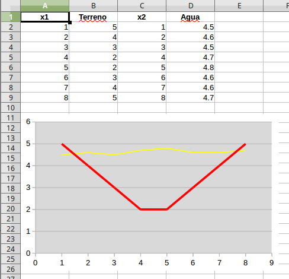

Charts
======

Chart XY
--------

Create chart from next data.

.. image:: images/img018.png
    :width: 400px
    :align: center

.. code-block:: vbnet

    Sub addChartXY()
        Dim pos_size As New com.sun.star.awt.Rectangle
        Dim series(1) As New org.universolibre.EasyDev.ChartSerie
        util = createUnoService("org.universolibre.EasyDev")

        address = createUnoStruct("org.universolibre.EasyDev.CellRangeAddress")
        data = createUnoStruct("org.universolibre.EasyDev.ChartData")

        doc = ThisComponent
        address.Doc = doc

        series(0).X = "Hoja1.A2:A9"
        series(0).Y = "Hoja1.B2:B9"
        series(0).Title = "Hoja1.B1"
        series(0).Color = 17798
        series(1).X = "Hoja1.C2:C9"
        series(1).Y = "Hoja1.D2:D9"
        series(1).Title = "Hoja1.D1"
        series(1).Color = 16728590

        pos_size.X = 0
        pos_size.Y = 5000
        pos_size.Width = 12000
        pos_size.Height = 7000

        data.Doc = doc
        data.Sheet = util.getSheet(address)
        data.Name = "Grafico01"
        data.Type = "XYDiagram"
        data.PosSize = pos_size
        data.Series = series

        chart = util.chartAdd(data)
    End Sub

Result.

