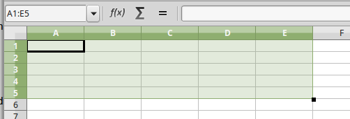

Tools
=====

Show info PC
------------

.. code-block:: vbnet

    Sub ShowInfoPC()
        util = createUnoService("org.universolibre.EasyDev")

        'Operator System
        util.msgbox(util.OS)

        'App Name
        util.msgbox(util.APP_NAME)

        'App Version
        util.msgbox(util.APP_VERSION)

        'App Language
        util.msgbox(util.LANGUAGE)

        'Size screen
        util.msgbox(util.getSizeScreen())

        ' https://docs.python.org/3.3/library/platform.html
        ' Get info PC:
        ' name user,
        ' name pc
        ' system/OS name,
        ' machine type,
        ' Returns the (real) processor name
        ' string identifying platform with as much useful information as possible,
        util.msgbox(util.getInfoPC())
    End Sub

Make question
-------------

.. code-block:: vbnet

    Sub Question()
        util = createUnoService("org.universolibre.EasyDev")

        title = "My App"
        message = "Is easy Python?"
        res = util.question(title, message)

        'If Yes return True, else return False
        util.msgbox(res)

    End Sub

Render string
--------------

Render text and replace arguments.

.. code-block:: vbnet

    Sub RenderString()
        util = createUnoService("org.universolibre.EasyDev")

        'Used NamedValue
        message = "Hello $data with $language, from Basic 1!!"
        Dim data1(1) As New com.sun.star.beans.NamedValue

        data1(0).Name = "data"
        data1(0).Value = "World"
        data1(1).Name = "language"
        data1(1).Value = "Python"
        message = util.render(message, data1)
        util.msgbox(message)

        'Used PropertyValue
        message = "Hello $data with $language, from Basic 2!!"
        Dim data2(1) As New com.sun.star.beans.PropertyValue

        data2(0).Name = "data"
        data2(0).Value = "World"
        data2(1).Name = "language"
        data2(1).Value = "Python"
        message = util.render(message, data2)
        util.msgbox(message)

        'Used Arrays
        message = "Hello $data with $language, from Basic 3!!"
        data = Array( _
            Array("data", "World"), _
            Array("language", "Python") _
        )
        message = util.render(message, data2)
        util.msgbox(message)

    End Sub

Format
------

Look more info and examples `here`_.

.. code-block:: vbnet

    Sub FormatData()
        util = createUnoService("org.universolibre.EasyDev")

        MsgBox util.format("Hello {}", "World")

        MsgBox util.format("Hello {} from {}", Array("World", "PyUNO"))

        MsgBox util.format("Hello {1} from {0}", Array("World", "PyUNO"))

        MsgBox util.format("{:<20}|{:^20}|{:>20}", Array("Left", "Center", "Rigth"))

        MsgBox util.format("{:_<20}|{:-^20}|{:_>20}", Array("Left", "Center", "Rigth"))

        MsgBox util.format("{:d} {:f}", Array(100, 3.1416))

        MsgBox util.format("{0:,.2f}", 123456789.2468)

        MsgBox util.format("Number {n1} y {n2}", Array(Array("n1", "one"), Array("n2", "two")))

        MsgBox util.format("Number {n2} y {n1}", Array(Array("n1", "one"), Array("n2", "two")))

        my_date = createUnoStruct("com.sun.star.util.Date")
        my_date.Day = 15
        my_date.Month = 1
        my_date.Year = 1974
        MsgBox util.format("{:%d-%B-%Y}", my_date)

        my_date = createUnoStruct("com.sun.star.util.DateTime")
        my_date.Day = 15
        my_date.Month = 1
        my_date.Year = 1974
        my_date.Hours = 13
        my_date.Minutes = 30

        MsgBox util.format("{:%Y-%b-%d %H:%M}", my_date)

    End Sub

Files and folders
-----------------

Return de path name in config. Look `XPathSettings`_.

.. code-block:: vbnet

    path = util.getPath("Temp")
    util.msgbox(path)
    path = util.getPath("Work")
    util.msgbox(path)

Get info from path: path base, file name, file name without extension, extension

.. code-block:: vbnet

    data = util.getPathInfo("/home/USER/log.txt")
    util.msgbox(data)

Join paths

.. code-block:: vbnet

    path = util.pathJoin(Array("/home", "USER", "Documents"))
    util.msgbox(path)
    path = util.pathJoin(Array("/home/USER/Documents", "..", "Picture"))
    util.msgbox(path)

Select folder, default path documents user

.. code-block:: vbnet

    folder = util.getFolder("")
    util.msgbox(folder)

    'With other init folder
    folder = util.getFolder("/home/USER")
    util.msgbox(folder)

Select one file without filters

.. code-block:: vbnet

    file = util.getSelectedFiles("", False, Array())
    util.msgbox(file)

Select multiple files

.. code-block:: vbnet

    files = util.getSelectedFiles("", True, Array())
    util.msgbox(files)

Select multiple files with filter

.. code-block:: vbnet

    filters = Array( _
        Array("TXT", "*.txt"), _
        Array("LOG", "*.log"), _
        Array("CER | KEY", "*.cer;*.key") _
    )
    files = util.getSelectedFiles("", True, filters)
    util.msgbox(files)

Get all files recursive

.. code-block:: vbnet

    files = util.getFiles("/home/USER/Pictures", "")
    util.msgbox(files)

Get all files with filter extension

.. code-block:: vbnet

    files = util.getFiles("/home/USER/Pictures", "jpg")
    util.msgbox(files)
    files = util.getFiles("/home/USER/Pictures", "png")
    util.msgbox(files)

Open file, read all content

.. code-block:: vbnet

    data = util.fileOpen("/home/USER/log.txt", "r", False)
    util.msgbox(data)

Open file, get lines in array

.. code-block:: vbnet

    data = util.fileOpen("/home/USER/log.txt", "r", True)
    util.msgbox(data)

Save data in new file

.. code-block:: vbnet

    data = "Hello World Python"
    util.fileSave("/home/USER/test.txt", "w", data)
    'Verify
    data = util.fileOpen("/home/mau/test.txt", "r")
    util.msgbox(data)

Save data in append file

.. code-block:: vbnet

    data = "Hello World Python" & CHR(10)
    util.fileSave("/home/USER/test2.txt", "a", data)
    'Verify
    data = util.fileOpen("/home/USER/test2.txt", "r")
    util.msgbox(data)

Execute
-------

Execute command and wait response

.. code-block:: vbnet

    res = util.execute(Array("ls","-la"), True)
    util.msgbox(res)

Execute command and not wait

.. code-block:: vbnet

    util.execute(Array("gnome-calculator"), False)

Config
------

Save value in config, save is persistente

.. code-block:: vbnet

    util.setConfig("DefaultMail", "test@correolibre.net")
    'Get value from config
    value = util.getConfig("DefaultMail")
    util.msgbox(value)

Is posible save arrays

.. code-block:: vbnet

    util.setConfig("Matriz", Array(1,2,3))
    value = util.getConfig("Matriz")
    util.msgbox(value)

Clipboard
---------

Get text from clipboard

.. code-block:: vbnet

    value = util.getClipboard()
    util.msgbox(value)

Send text to clipboard

.. code-block:: vbnet

    util.setClipboard("Hello World PyUNO!!")
    'Verify
    value = util.getClipboard()
    util.msgbox(value)

Unix time
---------

Look `<https://en.wikipedia.org/wiki/Unix_time>`_

.. code-block:: vbnet

    epoch = util.getEpoch()
    util.msgbox(epoch)

Call macros
-----------

Look: `Scripting Framework <https://wiki.openoffice.org/wiki/Documentation/DevGuide/Scripting/Scripting_Framework_URI_Specification>`_

Save next macro in:

``/home/USER/.config/libreoffice/4/user/Scripts/python/mymacros.py``
::

    import uno
    import time

    def show_time(cell):
        cell.setString(time.strftime('%c'))
        time.sleep(3)
        return

Call macro in Python (is default), wait end

.. code-block:: vbnet

    macro = createUnoStruct("org.universolibre.EasyDev.Macro")
    macro.Library = "mymacros"
    macro.Name = "show_time"
    cell = ThisComponent.CurrentSelection
    util.callMacro(macro, Array(cell))

.. image:: images/img005.png
    :width: 400px
    :align: center

Call macro in Python, and NOT wait end

.. code-block:: vbnet

    macro = createUnoStruct("org.universolibre.EasyDev.Macro")
    macro.Library = "mymacros"
    macro.Name = "show_time"
    macro.Thread = True
    cell = ThisComponent.CurrentSelection
    util.callMacro(macro, Array(cell))

Call macro in Basic

.. code-block:: vbnet

    macro = createUnoStruct("org.universolibre.EasyDev.Macro")
    macro.Library = "EasyDevLib"
    macro.Module = "Examples"
    macro.Name = "HelloWorld"
    macro.Language = "Basic"
    macro.Thread = False
    util.callMacro(macro, Array())

.. image:: images/img006.png
    :width: 150px
    :align: center

Timer
-----

Save next macro in:

``/home/USER/.config/libreoffice/4/user/Scripts/python/mymacros.py``
::

    import uno
    import time

    def show_time(cell):
        cell.setString(time.strftime('%c'))
        return

timer(NAME_TIMER, SECONDS_WAIT, MACRO, ARGUMENTS)

NAME_TIMER is import for stop timer. Timer always execute in other thread.

.. code-block:: vbnet

    util = createUnoService("org.universolibre.EasyDev")

    'Make data macro
    macro = createUnoStruct("org.universolibre.EasyDev.Macro")
    macro.Library = "mymacros"
    macro.Name = "show_time"
    'Arguments
    cell = ThisComponent.CurrentSelection
    'Timer name "time" and wait one second
    util.timer("time", 1, macro, Array(cell))

Stop timer for name

.. code-block:: vbnet

    Sub StopTimer()
        util = createUnoService("org.universolibre.EasyDev")
        util.stopTimer("time")
    End Sub

Export CSV
----------

Set range with data and select.

.. image:: images/img007.png
    :width: 400px
    :align: center

and export

.. code-block:: vbnet

    util = createUnoService("org.universolibre.EasyDev")

    range = ThisComponent.CurrentSelection

    path = "/home/USER/test.csv"
    data = range.getDataArray()
    options = Array()

    util.exportCSV(path, data, options)

Change options for export, look: `<https://docs.python.org/3.3/library/csv.html#csv.writer>`_

.. code-block:: vbnet

    Dim options(0) As New com.sun.star.beans.NamedValue

    util = createUnoService("org.universolibre.EasyDev")

    range = ThisComponent.CurrentSelection

    path = "/home/USER/test.csv"
    data = range.getDataArray()
    options(0).Name = "delimiter"
    options(0).Value = "|"
    util.exportCSV(path, data, options)

Import CSV
----------

Selected range must be with number exactly of columns and rows to import, only
for this example.

More options see: `<https://docs.python.org/3.3/library/csv.html#csv.reader>`_

and import

.. code-block:: vbnet

    util = createUnoService("org.universolibre.EasyDev")

    range = ThisComponent.CurrentSelection
    path = "/home/USER/test.csv"
    options = Array()
    data = util.importCSV(path, options)
    range.setDataArray(data)

.. _XPathSettings: http://api.libreoffice.org/docs/idl/ref/interfacecom_1_1sun_1_1star_1_1util_1_1XPathSettings.html
.. _here: https://pyformat.info/
.. _Download: http://extensions.openoffice.org/en/project/MRI
